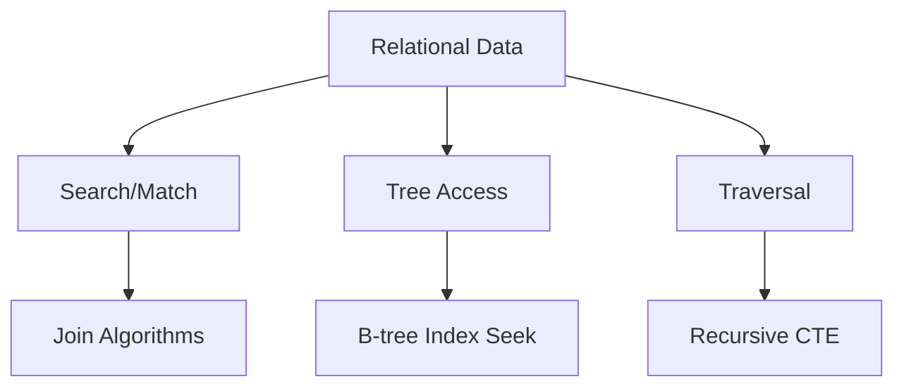

# DSA Connections — SQL Concepts Through Data Structures & Algorithms

## Purpose
This guide maps SQL topics in this repository to DSA intuition for faster learning.

## SQL ↔ DSA mapping
| SQL Topic | DSA Analogy | Why it helps |
|---|---|---|
| Joins | Hash lookup / merge of sorted arrays | Understand join algorithm choices |
| Indexes | B-tree traversal | Explain seek vs scan cost |
| Window functions | Ordered scan with rolling state | Explain cumulative metrics |
| Recursive CTE | Graph/tree traversal | Reason about hierarchy depth |
| Constraints | Invariants | Protect data integrity |
| Triggers | Event callbacks | Understand mutation side-effects |

## Visual map

## Practical example: join algorithm intuition
If right-side join key has supporting index and left side is small, nested loops behaves like repeated indexed lookup. If both sides huge and unsorted, hash join resembles building hash table then probing.

## Exercises
1. Explain one slow query using DSA vocabulary only.
2. Compare `EXISTS` vs `JOIN` as search patterns.
3. Draw recursion tree for org hierarchy query.

## Navigation
Previous: [vectors](../vectors/README.md)  
Next: [labs](../labs/README.md)
