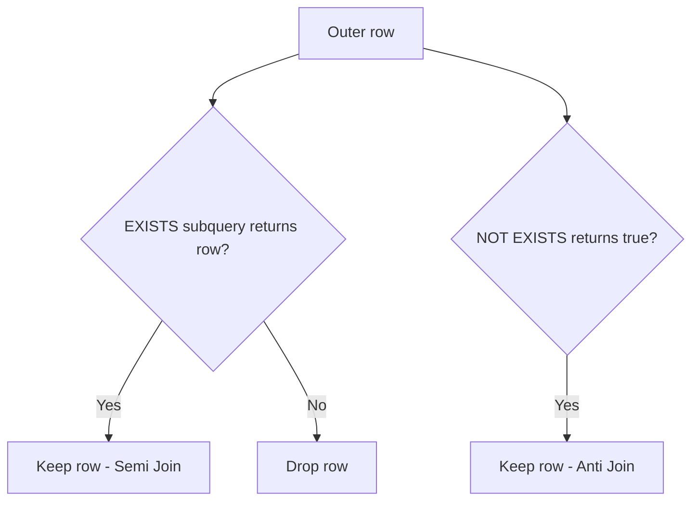

# JOins (Legacy Folder) — Companion to `Joins/`

> This folder remains for backward compatibility with existing links.  
> Canonical join learning path starts in [`../Joins/README.md`](../Joins/README.md).

## Why this file exists
Repository mein `Joins/` aur `JOins/` dono tracked hain. Duplication avoid karne ke liye:
- `Joins/README.md` = primary foundation guide.
- `JOins/README.md` = advanced companion (semi/anti join patterns, troubleshooting).

## Focus of this companion
- `EXISTS` as **semi join** mental model.
- `NOT EXISTS` as **anti join**.
- Safer alternatives to `NOT IN` with NULL.

## Visual model


## Demo schema
```sql
CREATE TABLE dbo.Customer
(
    CustomerID INT NOT NULL,
    CustomerName NVARCHAR(100) NOT NULL,
    CONSTRAINT PK_Customer PRIMARY KEY (CustomerID)
);

CREATE TABLE dbo.[Order]
(
    OrderID INT NOT NULL,
    CustomerID INT NOT NULL,
    OrderDate DATE NOT NULL,
    CONSTRAINT PK_Order PRIMARY KEY (OrderID),
    CONSTRAINT FK_Order_Customer FOREIGN KEY (CustomerID) REFERENCES dbo.Customer(CustomerID)
);
```

## Examples (line-by-line intent)
### Customers with at least one order (semi join)
```sql
SELECT
    c.CustomerID,
    c.CustomerName
FROM dbo.Customer AS c
WHERE EXISTS
(
    SELECT
        1
    FROM dbo.[Order] AS o
    WHERE o.CustomerID = c.CustomerID
);
```
- Outer query scans customers.
- Correlated predicate checks matching order.
- `EXISTS` short-circuits at first match.

### Customers with no orders (anti join)
```sql
SELECT
    c.CustomerID,
    c.CustomerName
FROM dbo.Customer AS c
WHERE NOT EXISTS
(
    SELECT
        1
    FROM dbo.[Order] AS o
    WHERE o.CustomerID = c.CustomerID
);
```
Expected result: only customers without related orders.

## NULL and edge cases
`NOT IN (SELECT CustomerID ...)` breaks when subquery returns NULL; `NOT EXISTS` remains correct.

## Performance notes
- Create an index on `dbo.[Order]` using `CustomerID` for efficient semi/anti probes.
- Optimizer may transform EXISTS into efficient semi join operator.

## Debugging hints
- Unexpected empty result? Check hidden NULL in `NOT IN` path.
- Slow query? confirm index on correlated key.

## Exercises
1. Rewrite anti join using LEFT JOIN + `IS NULL`, compare plans.
2. Detect customers with orders in last 30 days only.

## Navigation
Previous: [Joins foundation](../Joins/README.md)  
Next: [subquery](../subquery/README.md)
