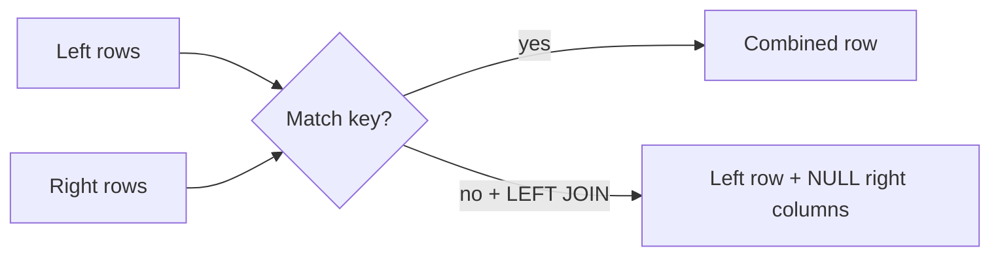

# Joins — Matching Rows Across Tables

## Table of Contents
- [Purpose and fit](#purpose-and-fit)
- [Prerequisites and objectives](#prerequisites-and-objectives)
- [Mental model](#mental-model)
- [Demo schema](#demo-schema)
- [Progressive examples with explanation](#progressive-examples-with-explanation)
- [Business use case](#business-use-case)
- [NULL/edge cases/concurrency](#nulledge-casesconcurrency)
- [Performance and indexing](#performance-and-indexing)
- [Security and maintainability](#security-and-maintainability)
- [Common errors and debugging](#common-errors-and-debugging)
- [Exercises](#exercises)
- [Navigation](#navigation)

## Purpose and fit
Joins combine normalized data into usable result sets. SQL Server optimizer chooses join algorithms (nested loops/hash/merge) based on stats and indexes.

## Prerequisites and objectives
Prerequisites: PK/FK, WHERE, ORDER BY.  
Objectives: choose correct join type and predict row shape.

## Mental model
Join is a **matching/search problem**.



## Demo schema
```sql
CREATE TABLE dbo.Department
(
    DepartmentID INT NOT NULL,
    DepartmentName NVARCHAR(100) NOT NULL,
    CONSTRAINT PK_Department PRIMARY KEY (DepartmentID)
);

CREATE TABLE dbo.Employee
(
    EmployeeID INT NOT NULL,
    DepartmentID INT NULL,
    FullName NVARCHAR(120) NOT NULL,
    Salary DECIMAL(12,2) NOT NULL,
    CONSTRAINT PK_Employee PRIMARY KEY (EmployeeID),
    CONSTRAINT FK_Employee_Department FOREIGN KEY (DepartmentID) REFERENCES dbo.Department(DepartmentID)
);
```

## Progressive examples with explanation
### 1) INNER JOIN
```sql
SELECT
    e.EmployeeID,
    e.FullName,
    d.DepartmentName
FROM dbo.Employee AS e
INNER JOIN dbo.Department AS d
    ON d.DepartmentID = e.DepartmentID;
```
- `INNER JOIN` keeps only matched rows.
- `ON` must contain full key match logic.

### 2) LEFT JOIN for missing relations
```sql
SELECT
    e.EmployeeID,
    e.FullName,
    d.DepartmentName
FROM dbo.Employee AS e
LEFT JOIN dbo.Department AS d
    ON d.DepartmentID = e.DepartmentID;
```
Expected interpretation:
- Employee without department still appears.
- `DepartmentName` becomes NULL.

### 3) Aggregation after join
```sql
SELECT
    d.DepartmentName,
    COUNT(e.EmployeeID) AS EmployeeCount
FROM dbo.Department AS d
LEFT JOIN dbo.Employee AS e
    ON e.DepartmentID = d.DepartmentID
GROUP BY
    d.DepartmentName;
```
- `COUNT(e.EmployeeID)` ignores NULL employee IDs.
- Good for zero-count departments.

## Business use case
HR dashboard combining employee roster with department metadata.

## NULL/edge cases/concurrency
- Join key NULL never equals NULL in standard equality join.
- Duplicate keys create multiplicative rows (many-to-many explosion).
- Under read committed, concurrent updates can change join results between statements.

## Performance and indexing
- Add index on foreign key side:
```sql
CREATE INDEX IX_Employee_DepartmentID ON dbo.Employee(DepartmentID);
```
- Missing indexes often force hash join + big memory grants.

## Security and maintainability
- Expose joins via views/procedures for stable contract.
- Avoid dynamic SQL join fragments from user input.

## Common errors and debugging
Debug checklist:
1. Row count too high? check duplicate join keys.
2. Missing rows? verify INNER vs LEFT join choice.
3. Wrong matches? validate data type compatibility and collation.

## Exercises
1. Beginner: list employees with/without department.
2. Intermediate: highest salary per department.
3. Advanced: detect duplicate department assignments by employee history table.

DSA connection: joins resemble **hash map lookup** (hash join) or **sorted merge** (merge join).

## Navigation
Previous: [TABLE](../TABLE/README.md)  
Next: [subquery](../subquery/README.md)  
Related: [JOins companion](../JOins/README.md), [indexes](../indexes/README.md)
