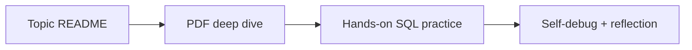

# PDFs Folder — Supplementary Material Guide

## Purpose
This folder stores supplementary PDF learning artifacts. This README explains how to use them with the SQL topic guides.

## How to use PDFs effectively
1. Read topic README first for mental model.
2. Use PDF for extra examples/visuals.
3. Return to SQL scripts/labs and implement from memory.

## Suggested study loop

## Quality checklist for any added PDF notes
- Topic alignment with folder name.
- Contains runnable SQL snippets with `dbo.` qualification.
- Mentions expected outputs and edge cases.
- Includes at least one debugging checklist.

## Navigation
Previous: [product-catalog-api](../product-catalog-api/README.md)  
Next: [PDFs legacy readme](./readme.md)
