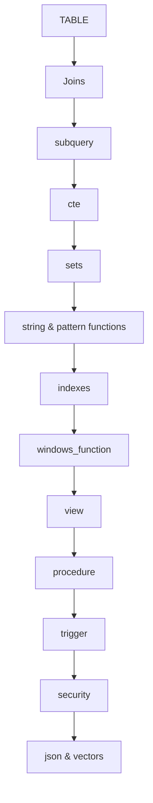

# intro_to_SQL — Deep Learning Manual

This repository is now a **topic-by-topic SQL Server learning manual**.  
Har folder ka README usi folder ke actual topic ko deep, visual, and practical tareeqe se explain karta hai.

## Table of Contents
- [How to use this repository](#how-to-use-this-repository)
- [Prerequisites](#prerequisites)
- [Learning objectives](#learning-objectives)
- [Learning path](#learning-path)
- [Conventions used in all examples](#conventions-used-in-all-examples)
- [Next step](#next-step)

## How to use this repository
1. Start from foundational topics (`TABLE`, `Joins`, `subquery`).
2. Move to intermediate (`cte`, `sets`, `string_functions`, `indexes`).
3. Then advanced (`windows_function`, `trigger`, `security`, `json`, `vectors`).
4. In each guide:
   - Read the mental model
   - Run demo schema
   - Execute examples in order
   - Do debugging checklist + exercises

## Prerequisites
- SQL Server basics (database, table, PK/FK).
- SSMS or Azure Data Studio.
- Ability to run T-SQL batches.

## Learning objectives
After completing all guides, you should be able to:
- Design safe and readable T-SQL.
- Choose joins/subqueries/CTEs/window functions correctly.
- Understand query-plan and index impact.
- Handle NULL, transactions, and concurrency risks.
- Write maintainable SQL artifacts (views/procedures/triggers).

## Learning path

## Topic map
| Folder | Focus |
|---|---|
| [`TABLE`](./TABLE/README.md) | table design, constraints, normalization |
| [`Joins`](./Joins/README.md) | inner/outer/cross joins + matching model |
| [`JOins`](./JOins/README.md) | legacy companion, anti/semi join focus |
| [`subquery`](./subquery/README.md) | scalar/correlated/EXISTS patterns |
| [`cte`](./cte/README.md) | modular query blocks + recursion |
| [`sets`](./sets/README.md) | UNION/INTERSECT/EXCEPT semantics |
| [`windows_function`](./windows_function/README.md) | analytics over ordered partitions |
| [`indexes`](./indexes/README.md) | B-tree mental model + access paths |
| [`view`](./view/README.md) | abstraction, reuse, and security boundaries |
| [`procedure`](./procedure/README.md) | parameterized, transactional server logic |
| [`trigger`](./trigger/README.md) | rowset-aware change reactions |
| [`string_functions`](./string_functions/README.md) | cleansing and parsing text |
| [`fuzzy_functions`](./fuzzy_functions/README.md) | tolerant matching strategies |
| [`patern match`](./patern%20match/README.md) | LIKE/PATINDEX/search patterns |
| [`json`](./json/README.md) | JSON read/write in SQL Server |
| [`vectors`](./vectors/README.md) | embeddings/vector similarity primer |
| [`security`](./security/README.md) | roles, least privilege, hardening |
| [`scaler_function`](./scaler_function/README.md) | scalar UDF behavior and pitfalls |
| [`check.sql`](./check.sql/README.md) | query validation and guardrails |
| [`DSA`](./DSA/README.md) | SQL + data-structure connections |
| [`labs`](./labs/README.md) | hands-on practice path |
| [`node`](./node/README.md) | app integration using parameterized queries |
| [`product-catalog-api`](./product-catalog-api/README.md) | API-facing SQL patterns |
| [`PDFs`](./PDFs/README.md) | supplementary static material |

## Conventions used in all examples
- Explicit column lists (no `SELECT *`).
- `dbo.` schema prefix.
- ANSI JOIN syntax.
- `SET NOCOUNT ON` in procedures.
- `TRY...CATCH` for data-modification workflows.
- Parameterized patterns (`sp_executesql` params or proc params), no unsafe concatenation.

## Next step
Start with **[TABLE guide](./TABLE/README.md)**, then continue to **[Joins](./Joins/README.md)**.
