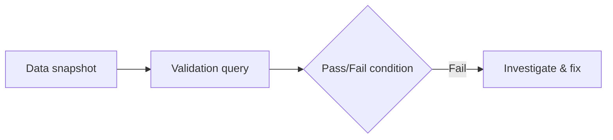

# check.sql — Validation Query Patterns

## Purpose
This folder documents SQL checks used to validate data integrity, quality, and deployment assumptions.

## Prerequisites/objectives
- Understand constraints and expected business invariants.
- Learn to build fast, explainable validation queries.

## Mental model
Checks are automated assertions over relational state.



## Example checks
### Orphan orders
```sql
SELECT
    o.OrderID,
    o.CustomerID
FROM dbo.[Order] AS o
WHERE NOT EXISTS
(
    SELECT
        1
    FROM dbo.Customer AS c
    WHERE c.CustomerID = o.CustomerID
);
```
Expected output: **zero rows**.

### Invalid total amount
```sql
SELECT
    o.OrderID,
    o.TotalAmount
FROM dbo.[Order] AS o
WHERE o.TotalAmount < 0;
```
Expected output: zero rows.

## Line-by-line strategy
- Each check projects identifiers needed for debugging.
- Conditions encode one invariant only (easier triage).

## Performance/security notes
- Add indexes on foreign keys for fast integrity checks.
- Read-only checks should use least-privilege account.

## Debugging checklist
- Is failure due to bad data or wrong rule?
- Is rule handling NULL correctly?
- Does transaction timing expose transient states?

## Exercises
1. Add duplicate email check.
2. Add stale status transition check.
3. Convert check queries into CI gate script.

DSA link: each check is invariant verification in a mutable data structure.

## Navigation
Previous: [security project](../security/MyDatabaseProject/README.md)  
Next: [JSON](../json/README.md)
