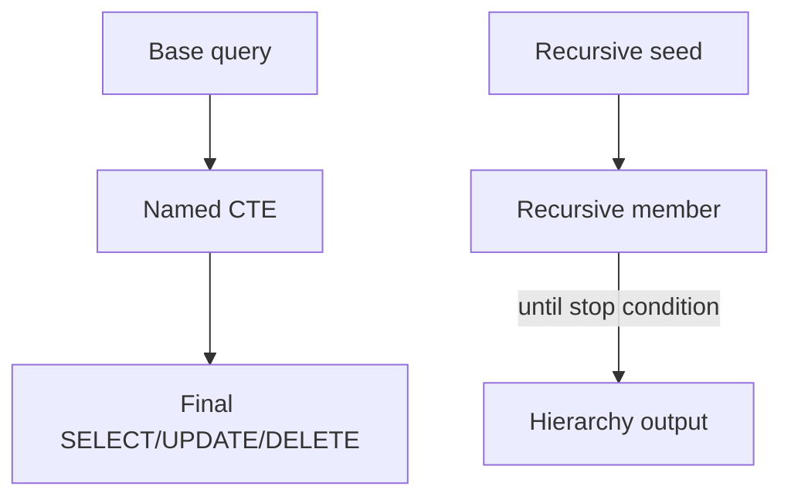

# CTE — Common Table Expressions

## Purpose and fit
CTE gives temporary named result sets inside one statement. It improves readability and supports recursion for tree/graph traversal.

## Prerequisites and objectives
- Understand SELECT + UNION ALL.
- Learn non-recursive and recursive CTE patterns.
- Identify termination logic and cycle risk.

## Mental model


## Demo schema
```sql
CREATE TABLE dbo.EmployeeHierarchy
(
    EmployeeID INT NOT NULL,
    ManagerID INT NULL,
    FullName NVARCHAR(100) NOT NULL,
    CONSTRAINT PK_EmployeeHierarchy PRIMARY KEY (EmployeeID)
);
```

## Progressive examples
### Non-recursive CTE
```sql
WITH SalaryBand AS
(
    SELECT
        eh.EmployeeID,
        eh.FullName,
        CASE
            WHEN eh.EmployeeID <= 100 THEN N'Core'
            ELSE N'Extended'
        END AS BandName
    FROM dbo.EmployeeHierarchy AS eh
)
SELECT
    sb.EmployeeID,
    sb.FullName,
    sb.BandName
FROM SalaryBand AS sb;
```
- `WITH SalaryBand` defines temporary named set.
- Final SELECT reads like table usage.

### Recursive CTE (org tree)
```sql
WITH OrgTree AS
(
    SELECT
        eh.EmployeeID,
        eh.ManagerID,
        eh.FullName,
        0 AS DepthLevel
    FROM dbo.EmployeeHierarchy AS eh
    WHERE eh.ManagerID IS NULL

    UNION ALL

    SELECT
        child.EmployeeID,
        child.ManagerID,
        child.FullName,
        parent.DepthLevel + 1 AS DepthLevel
    FROM dbo.EmployeeHierarchy AS child
    INNER JOIN OrgTree AS parent
        ON parent.EmployeeID = child.ManagerID
)
SELECT
    ot.EmployeeID,
    ot.ManagerID,
    ot.FullName,
    ot.DepthLevel
FROM OrgTree AS ot
OPTION (MAXRECURSION 100);
```
Key points:
- First SELECT = seed nodes.
- Second SELECT = recursive expansion.
- `MAXRECURSION` prevents runaway loops.

## Expected output interpretation
DepthLevel 0 = roots, 1 = direct reports, etc.

## Edge/concurrency/performance
- Cycles create infinite recursion risk.
- Large trees can spill memory; index `(ManagerID)`.
- Recursive CTE is read-consistent per statement, but source rows may change afterward.

## Security/maintainability
- Keep recursion depth guards explicit.
- Use procedures with parameters for subtree roots.

## Debugging guide
- Missing rows? verify seed condition.
- Infinite recursion? check accidental cycle data.
- Wrong depth? validate parent-child join direction.

## Exercises
1. Beginner: list only depth <= 2.
2. Intermediate: build path string (`CEO > VP > Manager`).
3. Advanced: detect cycles using visited path logic.

DSA connection: recursive CTE ≈ DFS/BFS-style traversal over adjacency list.

## Navigation
Previous: [subquery](../subquery/README.md)  
Next: [sets](../sets/README.md)
