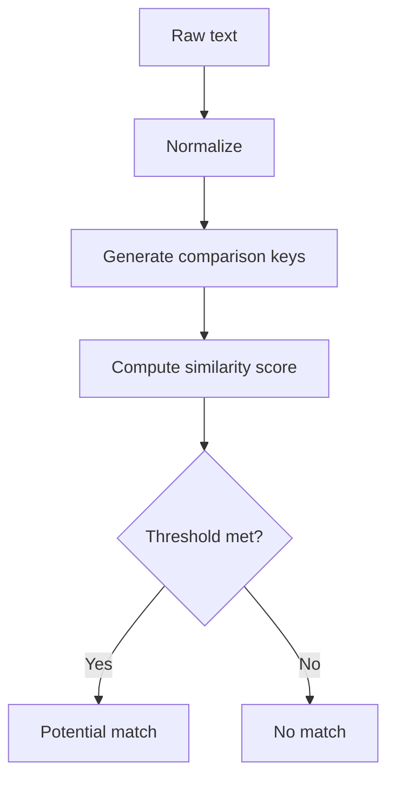

# Fuzzy Functions — Approximate Text Matching

## Purpose
Fuzzy matching handles typos and near-duplicates in names, addresses, or product titles.

## Prerequisites/objectives
- Familiarity with exact matching and pattern matching.
- Learn normalization + scoring strategy pipeline.

## Mental model


## Note on SQL Server
Native SQL Server fuzzy toolkit is limited; typical approach combines:
- normalization functions,
- `SOUNDEX`/`DIFFERENCE`,
- external ML service when needed.

## Demo example
```sql
SELECT
    c1.CustomerID,
    c1.CustomerName,
    c2.CustomerID AS CandidateCustomerID,
    c2.CustomerName AS CandidateCustomerName,
    DIFFERENCE(c1.CustomerName, c2.CustomerName) AS SimilarityScore
FROM dbo.Customer AS c1
INNER JOIN dbo.Customer AS c2
    ON c1.CustomerID < c2.CustomerID
WHERE DIFFERENCE(c1.CustomerName, c2.CustomerName) >= 3;
```
Line-by-line:
- Self-join compares each pair once (`<` condition).
- `DIFFERENCE` provides coarse phonetic similarity (0-4).
- Threshold filters candidate duplicates.

## Expected output
Rows are **candidates**, not guaranteed duplicates; manual review or additional rules needed.

## NULL/edge cases
- Phonetic algorithms are language-biased.
- NULL names skip meaningful comparison.

## Performance and concurrency
- Pairwise comparisons are O(n²); constrain search space first (same city, same initial).
- Precompute normalized keys in persisted columns.

## Security/maintainability
- Never auto-merge records on weak score alone.
- Keep merge actions auditable.

## Debugging approach
- Are false positives high? raise threshold.
- Are true matches missed? improve normalization before scoring.

## Exercises
1. Beginner: compare SOUNDEX outputs.
2. Intermediate: build staged dedup pipeline with review queue.
3. Advanced: integrate external embedding similarity and compare quality.

DSA link: fuzzy matching resembles nearest-neighbor search with approximate distance metrics.

## Navigation
Previous: [pattern match](../patern%20match/README.md)  
Next: [indexes](../indexes/README.md)
