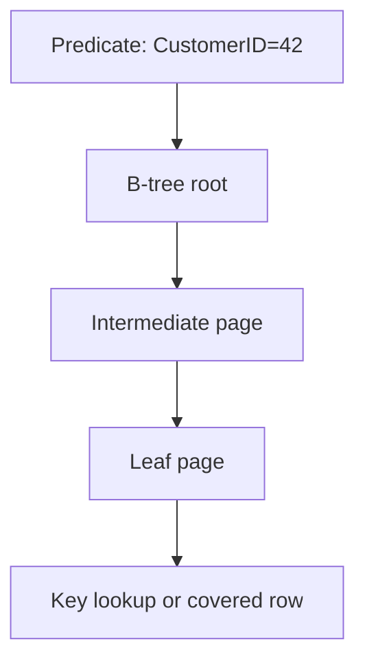

# Indexes — B-Tree Navigation for Fast Queries

## Purpose
Indexes reduce data access cost by providing ordered lookup paths.

## Prerequisites/objectives
- Understand clustered vs nonclustered indexes.
- Read high-level execution plan operators.

## Mental model


## Demo schema
```sql
CREATE TABLE dbo.SalesOrder
(
    SalesOrderID INT IDENTITY(1,1) NOT NULL,
    CustomerID INT NOT NULL,
    OrderDate DATE NOT NULL,
    StatusCode NVARCHAR(20) NOT NULL,
    TotalAmount DECIMAL(12,2) NOT NULL,
    CONSTRAINT PK_SalesOrder PRIMARY KEY (SalesOrderID)
);

CREATE INDEX IX_SalesOrder_CustomerID_OrderDate
    ON dbo.SalesOrder(CustomerID, OrderDate)
    INCLUDE (StatusCode, TotalAmount);
```

## Progressive examples
### Seek-friendly query
```sql
SELECT
    so.SalesOrderID,
    so.CustomerID,
    so.OrderDate,
    so.TotalAmount
FROM dbo.SalesOrder AS so
WHERE so.CustomerID = 42
  AND so.OrderDate >= '2026-01-01';
```
- Predicate aligns with index key order.
- INCLUDE columns reduce key lookups.

### Non-sargable anti-pattern
```sql
SELECT
    so.SalesOrderID,
    so.OrderDate
FROM dbo.SalesOrder AS so
WHERE YEAR(so.OrderDate) = 2026;
```
Why slow: function on column blocks seek.
Better:
```sql
WHERE so.OrderDate >= '2026-01-01'
  AND so.OrderDate < '2027-01-01';
```

## NULL/edge/concurrency
- Low-selectivity columns may not benefit from standalone indexes.
- Extra indexes increase write overhead and locking work.

## Security/maintainability
- Review index sprawl periodically.
- Keep naming convention `IX_Table_Column`.

## Debugging checklist
- Actual plan: seek or scan?
- Stats stale?
- Implicit conversion warning present?

## Exercises
1. Beginner: add index for `StatusCode` report query.
2. Intermediate: compare include vs key expansion.
3. Advanced: design filtered index for active orders.

DSA link: index seek is tree traversal (logarithmic path) vs scan (linear walk).

## Navigation
Previous: [fuzzy functions](../fuzzy_functions/README.md)  
Next: [windows function](../windows_function/README.md)
