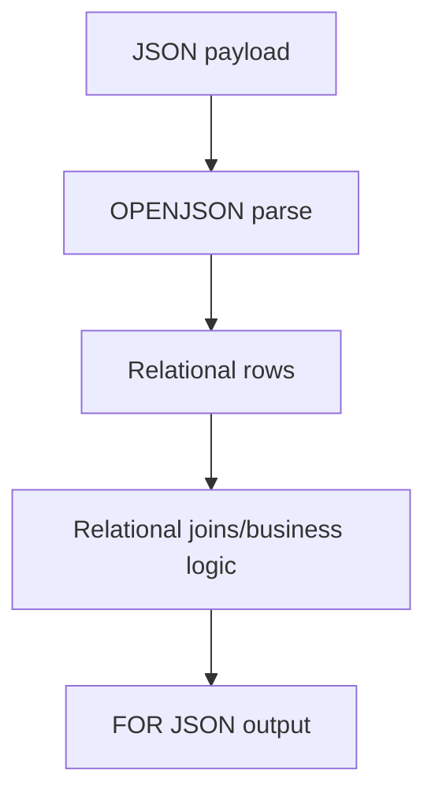

# JSON in SQL Server — Parse, Transform, Emit

## Purpose
JSON support enables hybrid relational + semi-structured workflows.

## Prerequisites/objectives
- Understand NVARCHAR storage.
- Learn `JSON_VALUE`, `JSON_QUERY`, `OPENJSON`, `FOR JSON`.

## Mental model


## Demo example
```sql
DECLARE @Payload NVARCHAR(MAX) = N'{
  "OrderID": 101,
  "CustomerID": 7,
  "Items": [
    { "Sku": "A1", "Qty": 2 },
    { "Sku": "B9", "Qty": 1 }
  ]
}';

SELECT
    JSON_VALUE(@Payload, '$.OrderID') AS OrderID,
    JSON_VALUE(@Payload, '$.CustomerID') AS CustomerID;
```
- `JSON_VALUE` extracts scalar value.

```sql
SELECT
    j.[Sku],
    j.[Qty]
FROM OPENJSON(@Payload, '$.Items')
WITH
(
    [Sku] NVARCHAR(20) '$.Sku',
    [Qty] INT '$.Qty'
) AS j;
```
- `OPENJSON ... WITH` shapes array into typed rows.

## Expected output
Two item rows: `(A1,2)` and `(B9,1)`.

## NULL/edge/performance
- Missing path returns NULL.
- Invalid JSON throws parsing errors.
- Use computed columns with indexes for heavily queried JSON properties.

## Security/maintainability
- Validate payload schema before writes.
- Avoid storing sensitive secrets inside ungoverned JSON blobs.

## Debugging
- `ISJSON(@Payload)` for quick validity check.
- Compare path casing and nesting when NULL appears unexpectedly.

## Exercises
1. Beginner: extract nested customer city.
2. Intermediate: insert OPENJSON rows into normalized table.
3. Advanced: build API response with nested `FOR JSON PATH`.

DSA link: JSON parse resembles tree traversal where path expressions navigate nodes.

## Navigation
Previous: [check.sql](../check.sql/README.md)  
Next: [vectors](../vectors/README.md)
