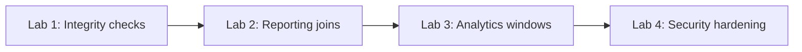

# Labs — Structured Practice Path

## Purpose
Labs convert concepts into hands-on skill with increasing difficulty.

## Prerequisites/objectives
Complete guides for TABLE, Joins, subquery, CTE, and indexes first.

## Lab progression

## Suggested lab set
1. **Data integrity lab:** create schema + constraints, then intentionally break/repair.
2. **Join diagnostics lab:** debug row multiplication and missing rows.
3. **Performance lab:** compare plans before/after index creation.
4. **Procedure + transaction lab:** implement safe order placement procedure.
5. **Security lab:** role-based read access and procedure-only writes.

## Evaluation rubric
- correctness of result,
- NULL/edge-case handling,
- plan awareness,
- maintainability/readability.

## Debugging workflow for labs
1. Reproduce issue with minimal query.
2. Validate assumptions on intermediate rowsets.
3. Check execution plan and cardinality.
4. Patch and rerun tests.

## Navigation
Previous: [DSA](../DSA/README.md)  
Next: [Labs MCP guidance](./createandmaintain_objects/mcp/.github/copilot-instructions.md)
