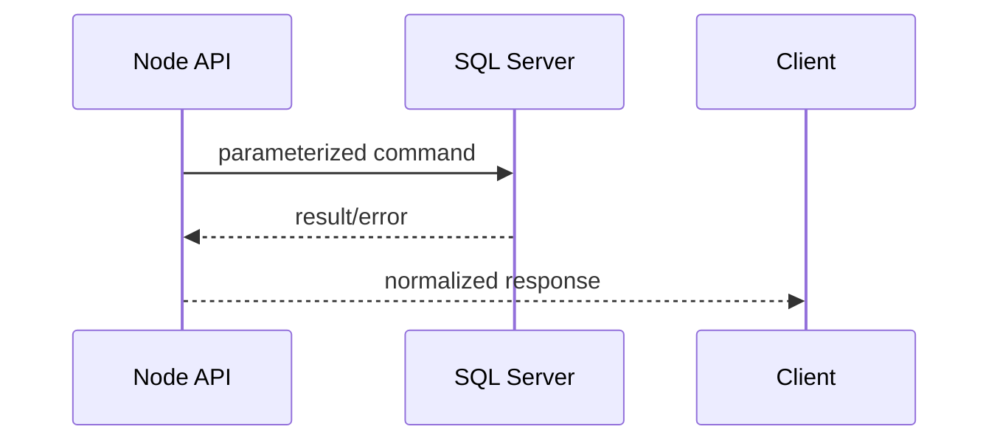

# Node Integration — Calling SQL Server Safely from Node.js

## Purpose
This guide explains SQL integration patterns relevant for Node-based apps in this repository context.

## Core principles
- Use parameterized queries only.
- Keep transaction boundaries explicit.
- Handle SQL errors with clear mapping.

## Flow


## Example (conceptual T-SQL endpoint contract)
```sql
CREATE OR ALTER PROCEDURE dbo.usp_GetCustomerOrders
    @CustomerID INT
AS
BEGIN
    SET NOCOUNT ON;

    SELECT
        o.OrderID,
        o.OrderDate,
        o.TotalAmount
    FROM dbo.[Order] AS o
    WHERE o.CustomerID = @CustomerID
    ORDER BY
        o.OrderDate DESC;
END;
```

Why app-facing procedures help:
- stable contract,
- permission hardening,
- easier plan tuning.

## Edge cases
- NULL parameter should be validated before query call.
- Retry only transient failures (timeouts/deadlocks), not logical errors.

## Exercises
1. Implement pagination params.
2. Add transaction for create-order + order-items.
3. Add structured error code mapping.

## Navigation
Previous: [labs](../labs/README.md)  
Next: [product-catalog-api](../product-catalog-api/README.md)
