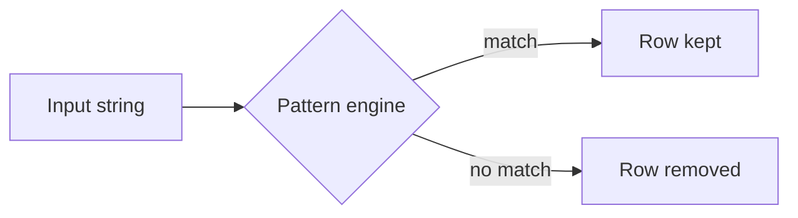

# Pattern Match — LIKE, PATINDEX, and Search Patterns

## Purpose
Pattern matching helps partial search, validation, and anomaly detection in SQL Server text columns.

## Prerequisites/objectives
- Understand wildcard characters (`%`, `_`, `[]`).
- Learn when to use LIKE vs PATINDEX.

## Visual model


## Demo table
```sql
CREATE TABLE dbo.LogEntry
(
    LogEntryID INT NOT NULL,
    MessageText NVARCHAR(400) NOT NULL,
    CreatedAt DATETIME2(0) NOT NULL,
    CONSTRAINT PK_LogEntry PRIMARY KEY (LogEntryID)
);
```

## Progressive examples
### LIKE for prefix search
```sql
SELECT
    le.LogEntryID,
    le.MessageText
FROM dbo.LogEntry AS le
WHERE le.MessageText LIKE N'ERROR:%';
```
- Prefix pattern can use index better than leading `%` patterns.

### PATINDEX for internal pattern position
```sql
SELECT
    le.LogEntryID,
    le.MessageText,
    PATINDEX(N'%timeout%', le.MessageText) AS TimeoutPosition
FROM dbo.LogEntry AS le
WHERE PATINDEX(N'%timeout%', le.MessageText) > 0;
```
Expected interpretation: positive position indicates match start.

## Business use case
Operational alerting: capture error and timeout messages for dashboard triage.

## NULL/edge/concurrency
- `LIKE` on NULL returns UNKNOWN (row excluded unless handled).
- Collation affects case sensitivity.

## Performance
- Leading wildcard (`%term`) usually prevents seeks.
- For large-scale search, evaluate full-text indexes.

## Security/maintainability
- Escape user-supplied wildcard characters to avoid overly broad searches.
- Keep search semantics documented in procedures.

## Debugging questions
- Is collation case-sensitive unexpectedly?
- Did wildcard placement accidentally match everything?

## Exercises
1. Beginner: find messages ending with `failed`.
2. Intermediate: detect IPv4-like patterns.
3. Advanced: compare LIKE vs full-text search strategy.

DSA link: prefix matching resembles trie/prefix search concepts.

## Navigation
Previous: [string functions](../string_functions/README.md)  
Next: [fuzzy functions](../fuzzy_functions/README.md)
