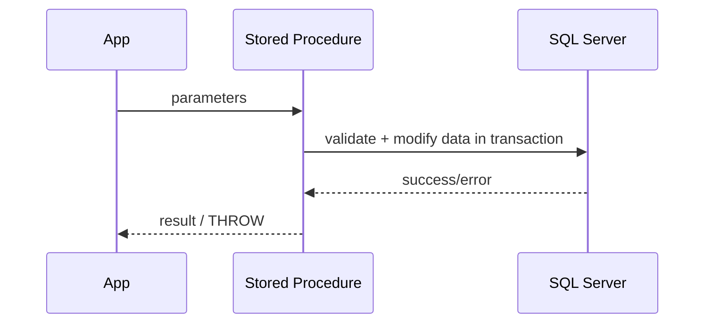

# Stored Procedure — Parameterized Server-Side Workflows

## Purpose
Stored procedures centralize business logic, validation, and transactional writes.

## Prerequisites/objectives
- Understand parameters and transactions.
- Apply `SET NOCOUNT ON` and `TRY...CATCH` consistently.

## Mental model


## Example procedure (self-contained pattern)
```sql
CREATE OR ALTER PROCEDURE dbo.usp_CreateCustomerOrder
    @CustomerID INT,
    @OrderDate DATE,
    @TotalAmount DECIMAL(12,2)
AS
BEGIN
    SET NOCOUNT ON;

    BEGIN TRY
        BEGIN TRANSACTION;

        IF NOT EXISTS
        (
            SELECT
                1
            FROM dbo.Customer AS c
            WHERE c.CustomerID = @CustomerID
        )
        BEGIN
            THROW 50001, 'Customer does not exist.', 1;
        END;

        INSERT INTO dbo.[Order]
        (
            CustomerID,
            OrderDate,
            TotalAmount
        )
        VALUES
        (
            @CustomerID,
            @OrderDate,
            @TotalAmount
        );

        COMMIT TRANSACTION;
    END TRY
    BEGIN CATCH
        IF @@TRANCOUNT > 0
        BEGIN
            ROLLBACK TRANSACTION;
        END;

        THROW;
    END CATCH
END;
```
Walkthrough:
- Validate parent existence using `EXISTS`.
- Wrap modification in explicit transaction.
- Rollback only when active transaction exists.

## Expected outcome
Atomic order creation with predictable error handling.

## Concurrency/edge cases
- High write concurrency may deadlock; enforce consistent access order.
- Parameter sniffing can impact plan quality for skewed values.

## Performance/security/maintainability
- Keep input strongly typed.
- Avoid string-concatenated dynamic SQL.
- Add supporting indexes for validation predicates.

## Debugging checklist
- Did THROW expose exact business failure?
- Was transaction left open?
- Is slow path due to missing index or sniffing?

## Exercises
1. Beginner: add output parameter for created order ID.
2. Intermediate: optional discount parameter with validation.
3. Advanced: idempotent insert using unique business key.

DSA link: procedure acts as controlled mutation API over underlying data structures.

## Navigation
Previous: [view](../view/README.md)  
Next: [trigger](../trigger/README.md)
