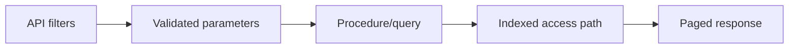

# Product Catalog API — SQL Design Notes

## Purpose
This guide documents SQL-side patterns for a product catalog API: filtering, pagination, sorting, and search safety.

## Mental model


## Example procedure pattern
```sql
CREATE OR ALTER PROCEDURE dbo.usp_SearchCatalog
    @CategoryID INT = NULL,
    @MinPrice DECIMAL(10,2) = NULL,
    @MaxPrice DECIMAL(10,2) = NULL,
    @PageNumber INT = 1,
    @PageSize INT = 20
AS
BEGIN
    SET NOCOUNT ON;

    SELECT
        p.ProductID,
        p.ProductName,
        p.Price,
        p.CategoryID
    FROM dbo.Product AS p
    WHERE (@CategoryID IS NULL OR p.CategoryID = @CategoryID)
      AND (@MinPrice IS NULL OR p.Price >= @MinPrice)
      AND (@MaxPrice IS NULL OR p.Price <= @MaxPrice)
    ORDER BY
        p.ProductID
    OFFSET (@PageNumber - 1) * @PageSize ROWS
    FETCH NEXT @PageSize ROWS ONLY;
END;
```
Line-by-line highlights:
- Optional filters use parameter-safe predicates.
- Deterministic ORDER BY mandatory for paging consistency.

## Performance/security notes
- Add index on `(CategoryID, Price, ProductID)` for common filters.
- Validate page size upper bound in app/proc.
- Avoid exposing raw DB errors to API consumers.

## Exercises
1. Add keyword search + ranking.
2. Add stock-availability filter with join.
3. Compare cursor pagination vs keyset pagination.

## Navigation
Previous: [node integration](../node/README.md)  
Next: [PDFs](../PDFs/README.md)
