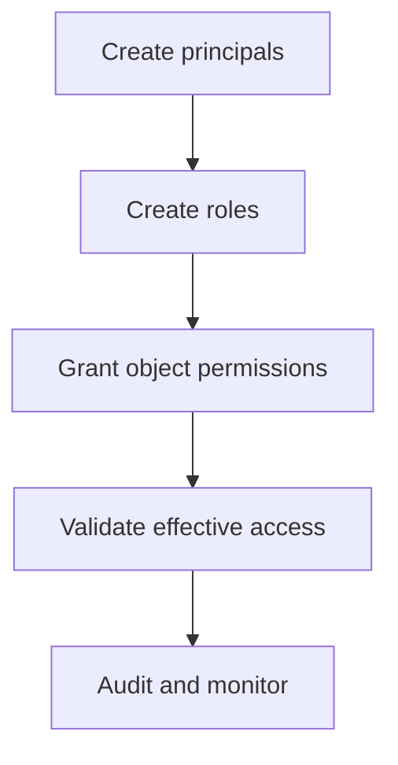

# MyDatabaseProject Security Walkthrough

## Purpose
This guide explains a practical security implementation checklist for a SQL Server database project folder.

## Prerequisites/objectives
- Familiar with roles, schemas, procedures.
- Learn deploy-time security validation steps.

## Deployment flow


## Suggested structure
- `dbo` for core objects.
- dedicated schema(s) for app-specific objects when needed.
- role scripts separated by responsibility.

## Example hardening checklist
1. Validate no `GRANT ... TO public`.
2. Verify all writable paths run through procedures with `TRY...CATCH`.
3. Check sensitive columns are not exposed in broad views.
4. Ensure deployment principal has least required rights.

## Practical verification queries
```sql
SELECT
    dp.name AS PrincipalName,
    dp.type_desc AS PrincipalType
FROM sys.database_principals AS dp
WHERE dp.type IN ('S', 'U', 'G', 'R')
ORDER BY
    dp.name;
```

```sql
SELECT
    pe.state_desc,
    pe.permission_name,
    OBJECT_SCHEMA_NAME(pe.major_id) AS ObjectSchemaName,
    OBJECT_NAME(pe.major_id) AS ObjectName,
    pr.name AS GranteeName
FROM sys.database_permissions AS pe
INNER JOIN sys.database_principals AS pr
    ON pr.principal_id = pe.grantee_principal_id
WHERE pe.class_desc = 'OBJECT_OR_COLUMN'
ORDER BY
    pr.name,
    ObjectSchemaName,
    ObjectName;
```
Interpretation:
- quickly spot over-privileged principals.
- review whether grants align with role design.

## Common mistakes
- granting direct table DML to app users.
- missing audit trail on critical updates.
- not testing security context in CI.

## Exercises
1. Build role matrix (reader/editor/admin).
2. Add validation script failing deployment on risky grants.
3. Simulate compromised app user and verify blast radius.

## Navigation
Previous: [security overview](../README.md)  
Next: [check.sql](../../check.sql/README.md)
