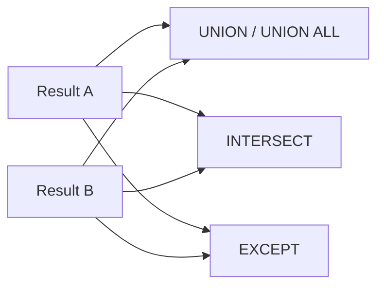

# SET Operations — UNION, INTERSECT, EXCEPT

## Purpose
Set operators combine two result sets using mathematical set semantics.

## Prerequisites/objectives
- Same number/type-compatible columns across inputs.
- Understand duplicate behavior and sorting cost.

## Mental model


## Demo schema
```sql
CREATE TABLE dbo.ActiveCustomer
(
    CustomerID INT NOT NULL,
    CustomerName NVARCHAR(100) NOT NULL,
    CONSTRAINT PK_ActiveCustomer PRIMARY KEY (CustomerID)
);

CREATE TABLE dbo.MarketingLead
(
    CustomerID INT NOT NULL,
    CustomerName NVARCHAR(100) NOT NULL,
    CONSTRAINT PK_MarketingLead PRIMARY KEY (CustomerID)
);
```

## Examples + line-by-line intent
### UNION ALL (keep duplicates)
```sql
SELECT
    ac.CustomerID,
    ac.CustomerName
FROM dbo.ActiveCustomer AS ac
UNION ALL
SELECT
    ml.CustomerID,
    ml.CustomerName
FROM dbo.MarketingLead AS ml;
```
- Fast append, no duplicate elimination.

### UNION (remove duplicates)
```sql
SELECT
    ac.CustomerID,
    ac.CustomerName
FROM dbo.ActiveCustomer AS ac
UNION
SELECT
    ml.CustomerID,
    ml.CustomerName
FROM dbo.MarketingLead AS ml;
```
- Adds deduplication step (sort/hash).

### INTERSECT and EXCEPT
```sql
SELECT
    ac.CustomerID,
    ac.CustomerName
FROM dbo.ActiveCustomer AS ac
INTERSECT
SELECT
    ml.CustomerID,
    ml.CustomerName
FROM dbo.MarketingLead AS ml;
```
```sql
SELECT
    ac.CustomerID,
    ac.CustomerName
FROM dbo.ActiveCustomer AS ac
EXCEPT
SELECT
    ml.CustomerID,
    ml.CustomerName
FROM dbo.MarketingLead AS ml;
```

## Result interpretation
- `INTERSECT` = overlap audience.
- `EXCEPT` = active customers missing from leads.

## NULL + edge cases
Set operators treat NULLs as equal for duplicate elimination context.

## Performance
- Prefer `UNION ALL` unless dedup is required.
- Align datatypes to avoid expensive implicit conversions.

## Security/maintainability
Use CTE wrappers to keep complex set logic readable.

## Debugging hints
- Column count mismatch error? align projection shapes.
- Unexpected duplicates? you used `UNION ALL`.

## Exercises
1. Beginner: compare two campaign lists with UNION/INTERSECT.
2. Intermediate: detect stale IDs with EXCEPT.
3. Advanced: benchmark UNION vs DISTINCT-on-UNION-ALL strategy.

DSA link: set operators map directly to set algebra operations.

## Navigation
Previous: [CTE](../cte/README.md)  
Next: [string functions](../string_functions/README.md)
