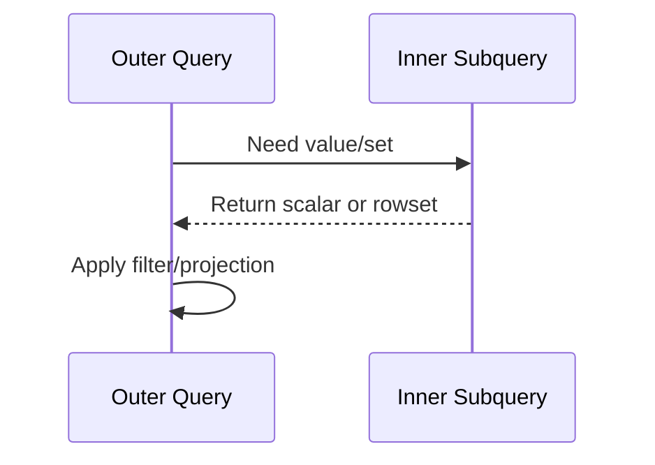

# Subquery — Thinking in Nested Questions

## Purpose
Subquery lets you ask SQL in layers: inner query computes context, outer query consumes it.

## Prerequisites + objectives
- Know SELECT, WHERE, GROUP BY.
- Learn scalar, table, and correlated subqueries.
- Choose between subquery and join patterns safely.

## Mental model


## Demo schema (self-contained)
```sql
CREATE TABLE dbo.Product
(
    ProductID INT NOT NULL,
    CategoryID INT NOT NULL,
    ProductName NVARCHAR(100) NOT NULL,
    Price DECIMAL(10,2) NOT NULL,
    CONSTRAINT PK_Product PRIMARY KEY (ProductID)
);
```

## Progressive examples
### Scalar subquery (compare with category average)
```sql
SELECT
    p.ProductID,
    p.ProductName,
    p.Price
FROM dbo.Product AS p
WHERE p.Price >
(
    SELECT
        AVG(p2.Price)
    FROM dbo.Product AS p2
    WHERE p2.CategoryID = p.CategoryID
);
```
Line-by-line:
- Outer row `p` is current candidate.
- Inner query recalculates average per matching category.
- Correlation `p2.CategoryID = p.CategoryID` binds inner to outer row.

Expected interpretation: returns above-average products within each category.

### EXISTS subquery
```sql
SELECT
    p.ProductID,
    p.ProductName
FROM dbo.Product AS p
WHERE EXISTS
(
    SELECT
        1
    FROM dbo.Product AS p2
    WHERE p2.CategoryID = p.CategoryID
      AND p2.Price > p.Price
);
```
Returns products where a higher-priced product exists in same category.

## Business use case
Pricing analytics: detect premium vs budget SKUs per category without materializing temporary joins manually.

## NULL, edge, concurrency
- If scalar subquery returns NULL, comparison may evaluate UNKNOWN.
- Correlated subqueries can be expensive if not indexed.
- Concurrent inserts can shift averages between executions.

## Performance/index notes
- Index `(CategoryID, Price)` supports both examples.
- For large data, test window-function rewrite for better scans.

## Security/maintainability
- Prefer readable aliases.
- Keep predicates deterministic and parameterized in procedures.

## Common errors + debugging
1. `Subquery returned more than 1 value` for scalar contexts.
2. Wrong correlations causing Cartesian logic.

Debug questions:
- Should inner query be aggregated?
- Does inner query truly depend on outer row?

## Exercises
1. Beginner: products cheaper than global average.
2. Intermediate: top-priced product per category via correlated subquery.
3. Advanced: compare subquery vs `ROW_NUMBER()` approach and plan cost.

DSA link: correlated subquery resembles repeated **search probe** per element.

## Navigation
Previous: [Joins](../Joins/README.md)  
Next: [CTE](../cte/README.md)
