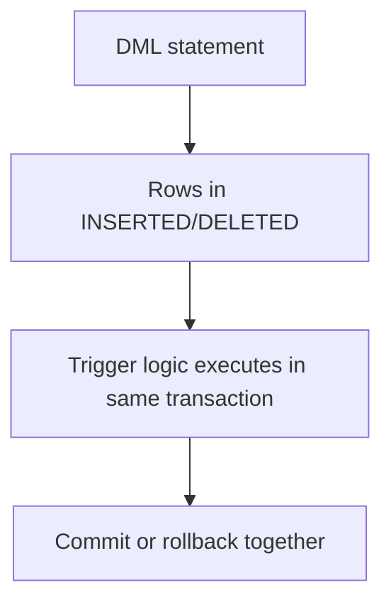

# Trigger — Automatic Reactions to Data Changes

## Purpose
Triggers enforce cross-row rules and audit changes when table events occur.

## Prerequisites/objectives
- Understand `INSERTED`/`DELETED` pseudo tables.
- Write set-based trigger logic (not row-by-row assumptions).

## Mental model


## Example (audit trigger)
```sql
CREATE TABLE dbo.OrderAudit
(
    AuditID INT IDENTITY(1,1) NOT NULL,
    OrderID INT NOT NULL,
    OldTotalAmount DECIMAL(12,2) NULL,
    NewTotalAmount DECIMAL(12,2) NULL,
    ChangedAt DATETIME2(0) NOT NULL,
    CONSTRAINT PK_OrderAudit PRIMARY KEY (AuditID)
);
GO

CREATE OR ALTER TRIGGER dbo.trg_Order_AuditUpdate
ON dbo.[Order]
AFTER UPDATE
AS
BEGIN
    SET NOCOUNT ON;

    INSERT INTO dbo.OrderAudit
    (
        OrderID,
        OldTotalAmount,
        NewTotalAmount,
        ChangedAt
    )
    SELECT
        d.OrderID,
        d.TotalAmount,
        i.TotalAmount,
        SYSUTCDATETIME()
    FROM inserted AS i
    INNER JOIN deleted AS d
        ON d.OrderID = i.OrderID
    WHERE i.TotalAmount <> d.TotalAmount
       OR (i.TotalAmount IS NULL AND d.TotalAmount IS NOT NULL)
       OR (i.TotalAmount IS NOT NULL AND d.TotalAmount IS NULL);
END;
```
Line-by-line focus:
- Trigger handles **all updated rows** in one statement.
- Explicit NULL-safe comparison avoids missed changes.

## Business use case
Financial audit trail for order amount modifications.

## Concurrency/edge/performance
- Trigger work extends transaction time and lock duration.
- Keep trigger lean; expensive logic can hurt throughput.
- Recursive trigger chains can cause surprises.

## Security/maintainability
- Restrict direct table updates if audit is mandatory.
- Document trigger side effects near table DDL.

## Debugging questions
- Did trigger fire for multi-row update?
- Are audit rows duplicated due to repeated updates?
- Is trigger causing deadlock with downstream writes?

## Exercises
1. Beginner: add DELETE audit trigger.
2. Intermediate: include `ChangedBy` from SESSION_CONTEXT.
3. Advanced: compare trigger audit vs temporal tables.

DSA link: triggers are event-driven callbacks on data-structure mutations.

## Navigation
Previous: [procedure](../procedure/README.md)  
Next: [security](../security/README.md)
