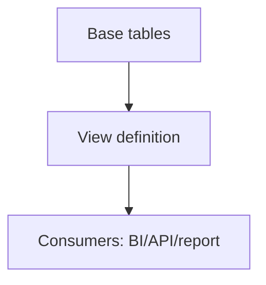

# View — Reusable Query Abstraction Layer

## Purpose
Views package stable query logic for reuse, governance, and simplified consumption.

## Prerequisites/objectives
- Know joins and filtering.
- Learn when view is suitable vs stored procedure.

## Mental model


## Demo
```sql
CREATE OR ALTER VIEW dbo.vw_ActiveCustomerOrders
AS
SELECT
    c.CustomerID,
    c.CustomerName,
    o.OrderID,
    o.OrderDate,
    o.TotalAmount
FROM dbo.Customer AS c
INNER JOIN dbo.[Order] AS o
    ON o.CustomerID = c.CustomerID
WHERE o.OrderDate >= DATEADD(DAY, -30, CAST(SYSUTCDATETIME() AS DATE));
```
Line-by-line:
- `CREATE OR ALTER` makes deployment idempotent.
- Explicit columns create stable contract.
- Predicate narrows to active window.

## Expected output
Current 30-day customer orders with customer metadata.

## Business use case
Reporting team queries view without reimplementing joins every time.

## NULL/edge/performance
- Views do not store data (unless indexed view).
- Complex nested views can hide expensive plans.
- Filter pushdown may or may not happen depending on definition.

## Security/maintainability
- Grant SELECT on view instead of base tables for least privilege.
- Keep names predictable (`vw_EntityName`).

## Debugging
- Wrong rows? script view text and verify hidden predicates.
- Slow view? inspect expanded execution plan against base tables.

## Exercises
1. Beginner: create region-filtered customer view.
2. Intermediate: compare direct query vs view plan.
3. Advanced: evaluate indexed view requirements and restrictions.

DSA link: a view is like an abstraction interface hiding data-structure internals.

## Navigation
Previous: [windows function](../windows_function/README.md)  
Next: [procedure](../procedure/README.md)
