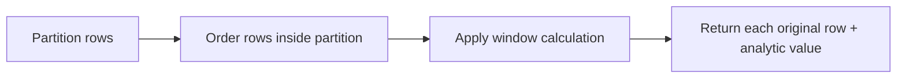

# Window Functions — Analytics Without Collapsing Rows

## Purpose
Window functions compute running/relative metrics while preserving row granularity.

## Prerequisites/objectives
- Understand GROUP BY and ordering.
- Learn `ROW_NUMBER`, `RANK`, `SUM() OVER`, `LAG/LEAD`.

## Mental model


## Demo schema
```sql
CREATE TABLE dbo.SalesFact
(
    SalesFactID INT NOT NULL,
    SalesRepID INT NOT NULL,
    SaleDate DATE NOT NULL,
    Amount DECIMAL(12,2) NOT NULL,
    CONSTRAINT PK_SalesFact PRIMARY KEY (SalesFactID)
);
```

## Progressive examples
### Ranking per sales rep
```sql
SELECT
    sf.SalesRepID,
    sf.SaleDate,
    sf.Amount,
    ROW_NUMBER() OVER
    (
        PARTITION BY sf.SalesRepID
        ORDER BY sf.SaleDate DESC, sf.SalesFactID DESC
    ) AS RowNumPerRep
FROM dbo.SalesFact AS sf;
```
- `PARTITION BY` resets numbering per rep.
- Deterministic tie-break uses `SalesFactID`.

### Running total
```sql
SELECT
    sf.SalesRepID,
    sf.SaleDate,
    sf.Amount,
    SUM(sf.Amount) OVER
    (
        PARTITION BY sf.SalesRepID
        ORDER BY sf.SaleDate, sf.SalesFactID
        ROWS BETWEEN UNBOUNDED PRECEDING AND CURRENT ROW
    ) AS RunningAmount
FROM dbo.SalesFact AS sf;
```
Expected result: cumulative amount grows row-by-row per rep.

### Change from previous sale
```sql
SELECT
    sf.SalesRepID,
    sf.SaleDate,
    sf.Amount,
    sf.Amount - LAG(sf.Amount, 1, 0) OVER
    (
        PARTITION BY sf.SalesRepID
        ORDER BY sf.SaleDate, sf.SalesFactID
    ) AS DeltaFromPrevious
FROM dbo.SalesFact AS sf;
```

## Business use case
Sales leaderboard, trend tracking, and anomaly detection in one pass.

## NULL/edge/concurrency
- `LAG` default handles partition-start rows.
- Non-deterministic ORDER BY causes unstable rankings.

## Performance
- Window sorts are expensive; support with `(SalesRepID, SaleDate)` index.
- Watch memory grant spills in execution plan.

## Security/maintainability
Encapsulate analytics in views/procedures to keep BI logic consistent.

## Debugging hints
- Wrong rank? verify partition and order columns.
- Running total resets unexpectedly? wrong partition key.

## Exercises
1. Beginner: top 3 sales per rep.
2. Intermediate: month-over-month percent change.
3. Advanced: combine window + CTE for cohort retention.

DSA link: window functions behave like ordered scans with rolling state.

## Navigation
Previous: [indexes](../indexes/README.md)  
Next: [view](../view/README.md)
